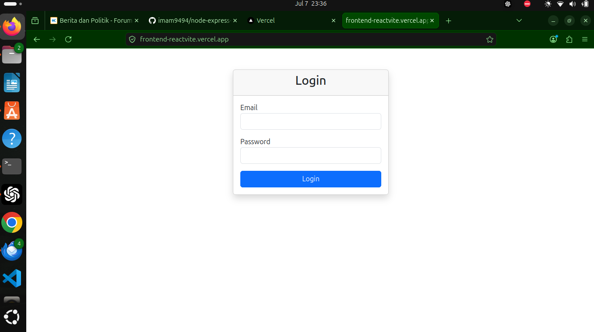
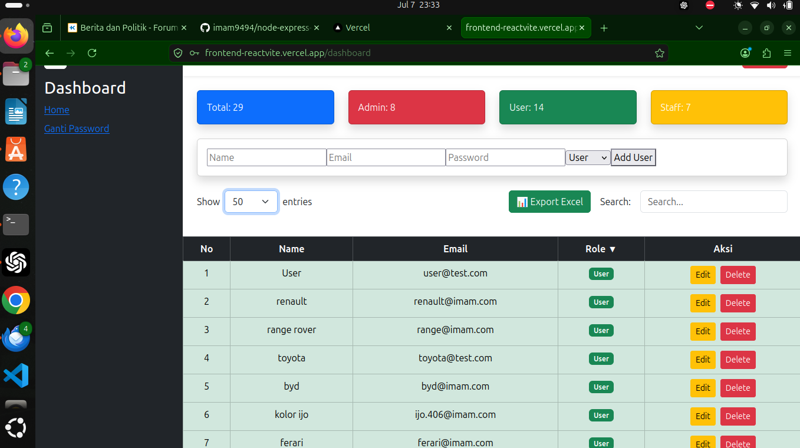

## Login



## Dashboard


# React + Vite

This template provides a minimal setup to get React working in Vite with HMR and some ESLint rules.

Currently, two official plugins are available:

- [@vitejs/plugin-react](https://github.com/vitejs/vite-plugin-react/blob/main/packages/plugin-react/README.md) uses [Babel](https://babeljs.io/) for Fast Refresh
- [@vitejs/plugin-react-swc](https://github.com/vitejs/vite-plugin-react-swc) uses [SWC](https://swc.rs/) for Fast Refresh
# react-vite-node.js-mysql
# react-vite-node.js-mysql
# React Vite Node.js MySQL User Management

Aplikasi Full Stack User Management menggunakan React, Vite, Node.js, Express, MySQL dan JWT Authentication.

## Tech Stack

### Frontend

- React
- Vite
- Bootstrap
- Axios
- React Router DOM

### Backend

- Node.js
- Express
- MySQL
- JWT
- bcrypt
- dotenv

## Features

- Login
- Logout
- JWT Authentication
- Refresh Token
- CRUD User
- Search User
- Pagination
- Role Admin
- Responsive Dashboard

## Project Structure

```
frontend/
backend/
```

## Frontend Installation

```bash
npm install
npm run dev
```

## Backend Installation

```bash
npm install
node index.js
```

## Environment Variable

Backend

```env
DB_HOST=localhost
DB_USER=your_database_user
DB_PASSWORD=your_database_password
DB_NAME=your_database_name

JWT_SECRET=your_jwt_secret
JWT_REFRESH_SECRET=your_refresh_secret

PORT=3000
```

Frontend

```env
VITE_API_URL=http://localhost:3000/api/v1
```

## Deployment

Frontend

- Vercel

Backend

- Node.js
- Cloudflare Tunnel

## Repository

Frontend

https://github.com/imam9494/react-vite-frontend


Backend
# React Vite User Management

A Full Stack User Management System built with React, Vite, Express.js, MySQL, and JWT Authentication.

## Features

- JWT Authentication
- Refresh Token
- Login & Logout
- CRUD User
- Search User
- Pagination
- Export Excel
- Role Based Access (Admin/User)
- Change Password

## Tech Stack

### Frontend

- React
- Vite
- Bootstrap
- Axios

### Backend

- Node.js
- Express.js
- MySQL
- JWT
- bcrypt

## Screenshots

### Login


### Dashboard



## Installation

### Frontend

```bash
npm install
npm run dev
```

### Backend

```bash
npm install
npm start
```

## Environment Variables

Frontend

```env
VITE_API_URL=http://localhost:3000/api/v1
```

Backend

```env
DB_HOST=localhost
DB_USER=appuser
DB_PASSWORD=app123
DB_NAME=auth_app

JWT_SECRET=your_secret
JWT_REFRESH_SECRET=your_refresh_secret

PORT=3000
```

## Author

Muhammad Imamudin
https://github.com/imam9494/node.js-react-vite-mysql-backend

